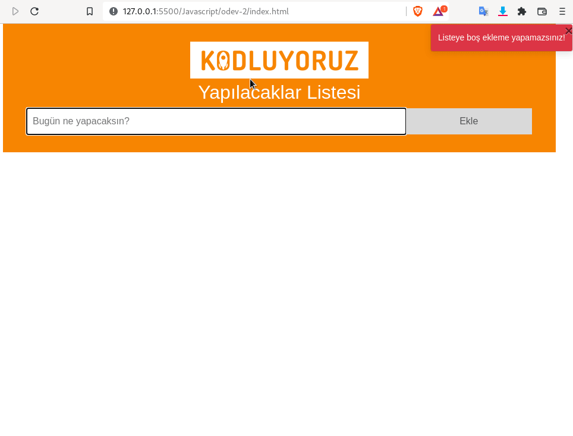

# Javascript

### Ödev-2



* local Storage'e bilgiler aşağıdaki formatta yapıldı(isDone) bilgisiyle kaydedildi. 

```json
    [
        {
            "isDone": "false",
            "todo": "çay iç"
        },
        {
            "isDone": "true",
            "todo": "çalış"
        },
        {
            "isDone": "false",
            "todo": "dinlen"
        }
    ]
```

* Toast özelleştirilecek notify fonksiyonu kullanıldı.

```js

notify('false', 'Listeye boş ekleme yapamazsınız!');

```