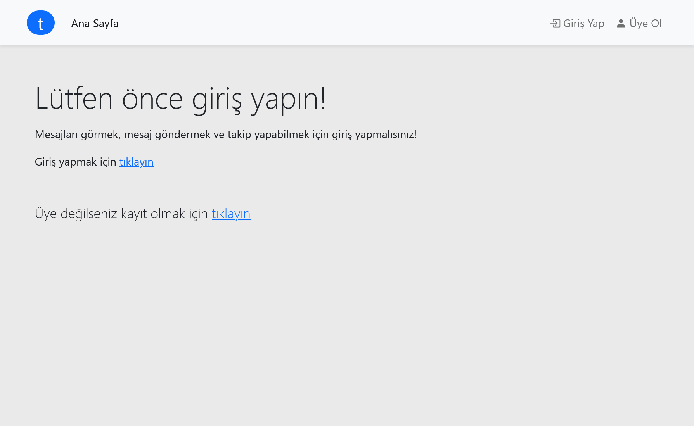
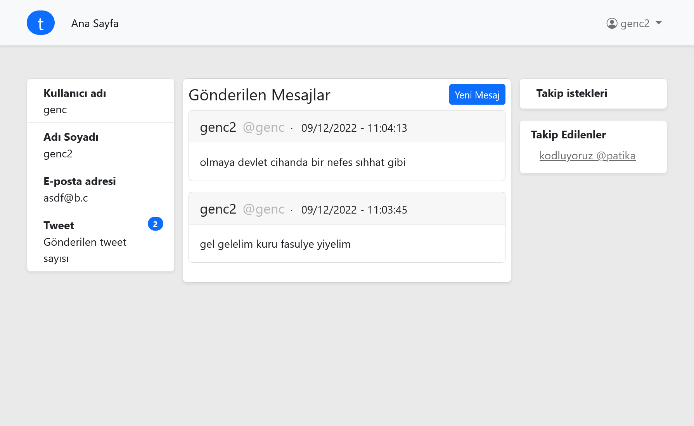
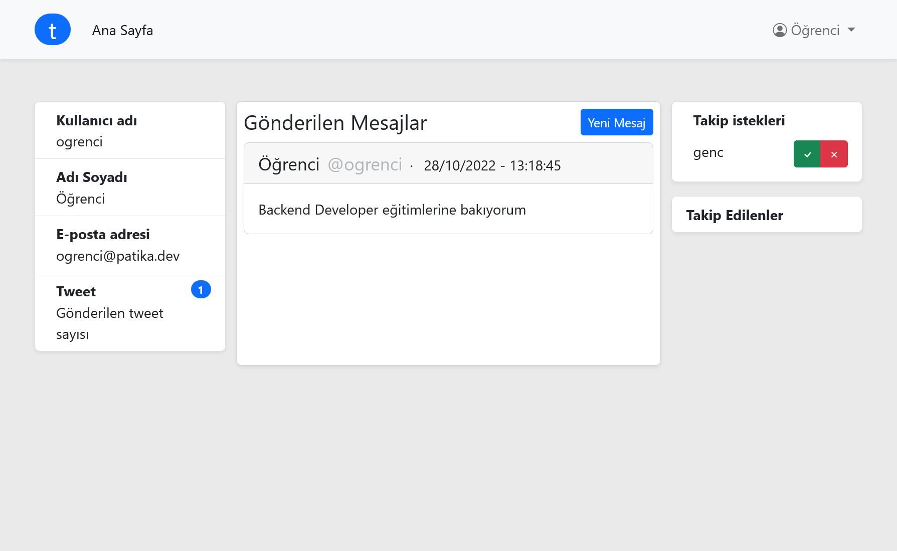
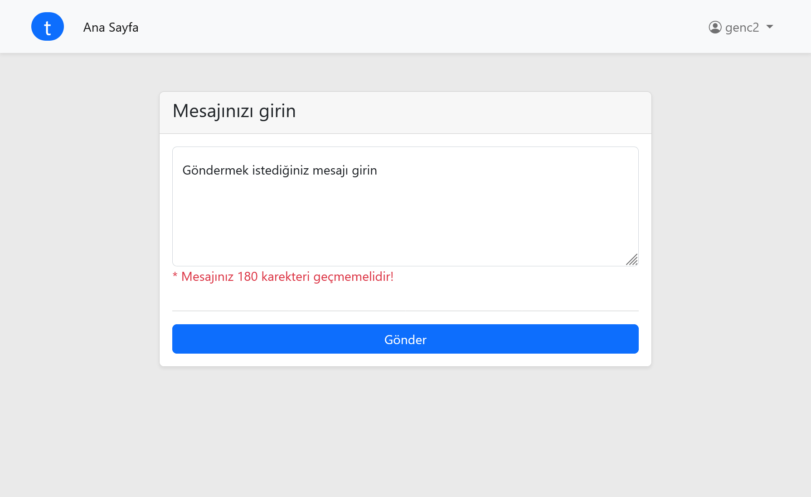

# Patika / PHP ile Backend Patikası Projeleri - Tweet Uygulaması

## [ Patika Profil](https://app.patika.dev/pooldata)

## Ekran görüntüleleri

* [ x ] Kullanıcılar bir kullanıcı adı ve şifresi ile uygulamaya kayıt olabilir.
* [ x ] Kayıtlı kullanıcıların bir profil sayfası olur.
* [ x ] Kayıtlı kullanıcılar 180 karekterlik tweet paylaşabilir.
* [ x ] Kayıtlı olmayan kullanıcılar tweet okuyamaz.
* [ x ] Son gönderilen tweet sayfanın başında gösterilir.
* [ x ] Üyeler bir birlerine takip isteği gönderebilir. Takip isteği alan kişi kabul/ret * edebilir.
* [ x ] Arkadaş olmuş kullanıcılar bir birlerinin sayfasına girerek tweetlerini okuyabilir.
* [ x ] Anasayfada arkadaşlarının tweetlerini son gönderilen en üstte olacak şekilde görür.
