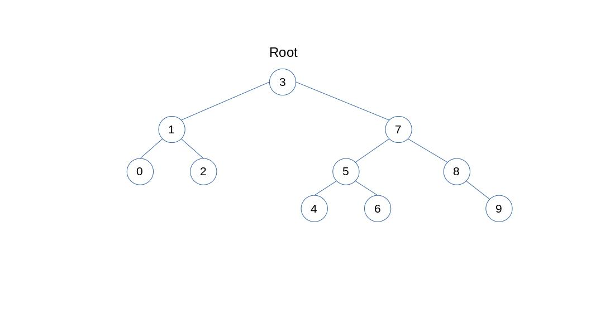

# Binary Search Tree Projesi

## Proje 3

### 1. [7, 5, 1, 8, 3, 6, 0, 9, 4, 2] dizisinin Binary-Search-Tree aşamalarını yazınız.  
Örnek: root x'dir. root'un sağından y bulunur. Solunda z bulunur vb.

> 
Burada root 3 dür. 
 * 7 root'dan büyük sağında
 * 5 root'dan büyük sağında, 7den küçük solunda
 * 1 root'dan küçük sağında
 * 8 root'dan büyük sağında, 7 den büyük sağında
 * 6 root'dan büyük sağında, 7 den küçük solunda, 5 den büyük sağında
 * 0 root'dan küçük solda, 1 den küçük solunda
 * 9 root'dan büyük sağında, 7 den büyük sağında, 8 den büyük sağında
 * 4 root'dan büyük sağında, 7 den küçük solunda, 5 den küçük solunda
 * 2 root'dan küçük solunda, 1 den büyük sağında